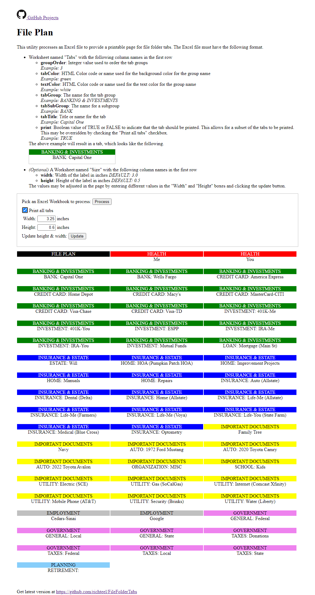
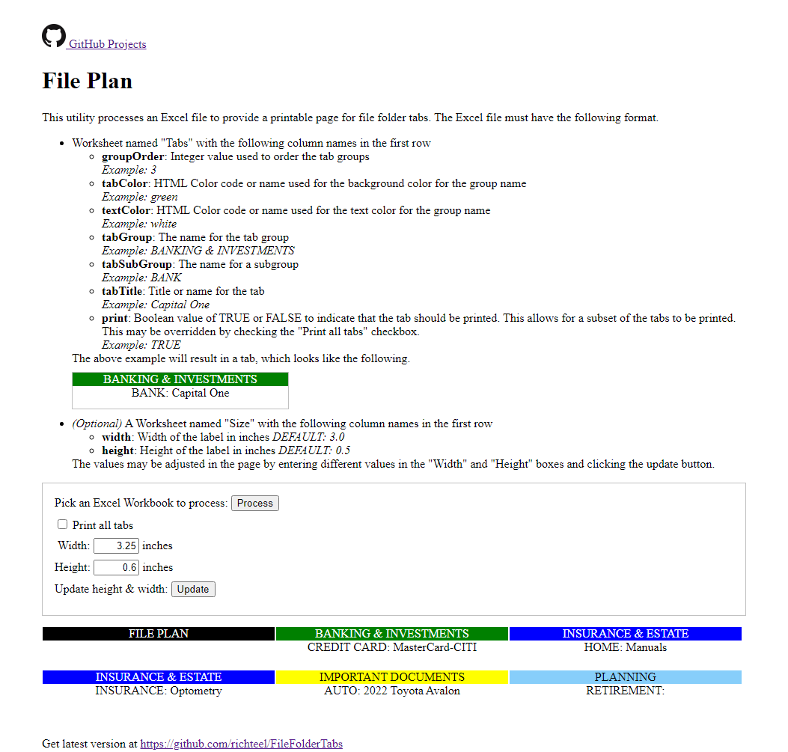

# FileFolderTabs

This utility processes an Excel file to provide a printable page for file folder tabs. The Excel file must have the following format.

<ul>
	<li>
		Worksheet named "Tabs" with the following column names in the first row
		<ul>
			<li>
				<strong>groupOrder</strong>: Integer value used to order the tab groups 
				<i>Example: 3</i>
			</li>
			<li>
				<strong>tabColor</strong>: HTML Color code or name used for the background color for the group name 
				<i>Example: green</i>
			</li>
			<li>
				<strong>textColor</strong>: HTML Color code or name used for the text color for the group name 
				<i>Example: white</i>
			</li>
			<li>
				<strong>tabGroup</strong>: The name for the tab group 
				<i>Example: BANKING & INVESTMENTS</i>
			</li>
			<li>
				<strong>tabSubGroup</strong>: The name for a subgroup 
				<i>Example: BANK</i>
			</li>
			<li>
				<strong>tabTitle</strong>: Title or name for the tab 
				<i>Example: Capital One</i>
			</li>
			<li>
				<strong>print</strong>: Boolean value of TRUE or FALSE to indicate that the tab should be printed. This allows for a subset of 
				the tabs to be printed. This may be overridden by checking the "Print all tabs" checkbox. 
				<i>Example: TRUE</i>
			</li>
		</ul>
		The above example will result in a tab, which looks like the following.  
		

			
BANKING &amp; INVESTMENTS

			
BANK: Capital One

		

	</li>
	<li>
		<i>(Optional)</i> A Worksheet named "Size" with the following column names in the first row
		<ul>
			<li><strong>width</strong>: Width of the label in inches <i>DEFAULT: 3.0</i></li>
			<li><strong>height</strong>: Height of the label in inches <i>DEFAULT: 0.5</i></li>
		</ul>
		The values may be adjusted in the page by entering different values in the "Width" and "Height" boxes and clicking the update button.
	</li>
</ul>

Unchecking the "Print all tabs" checkbox will only display items with "print" set to TRUE in the Excel workbook.

NOTE: The "Print all tabs" checkbox is checked

Included is a sample Excel document, File Plan.xlsx. If the file is used by this application, you will see the following output.

NOTE: The "Print all tabs" checkbox is unchecked

